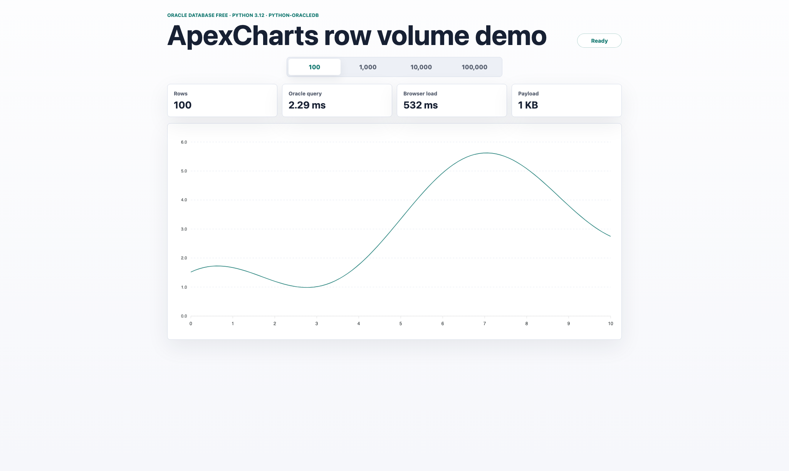

# oracle-python-apex-chart

A Docker Compose demo with:

- Oracle Database Free from `gvenzl/oracle-free:slim`
- Python 3.12
- `python-oracledb`
- FastAPI
- ApexCharts

The app seeds a deterministic Oracle table with 100,000 rows, then the browser can request charts backed by 100, 1,000, 10,000, or 100,000 rows.

## Screenshot



## Run

```sh
docker compose up --build
```

Open [http://localhost:8000](http://localhost:8000).

The first run can take a few minutes while Oracle initializes and the Python app waits for the database to accept connections.

## Services

| Service | Port | Notes |
| --- | --- | --- |
| `oracle` | `1521` | Uses the local `gvenzl/oracle-free:slim` image when it exists. |
| `app` | `8000` | Serves the FastAPI API and static ApexCharts page. |

## Oracle connection

Compose creates an application user through the Oracle image environment:

- User: `demo`
- Password: `DemoPassword123`
- DSN from the app container: `oracle:1521/FREEPDB1`

The seed table is `DEMO_CHART_POINTS`.

## API

```sh
curl "http://localhost:8000/api/chart-data?rows=100000"
```

Available row presets:

```sh
curl "http://localhost:8000/api/row-presets"
```

Health check:

```sh
curl "http://localhost:8000/api/health"
```
